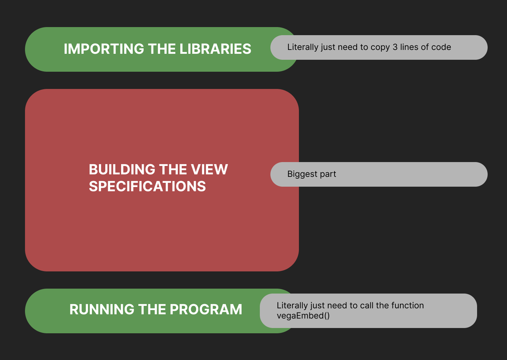
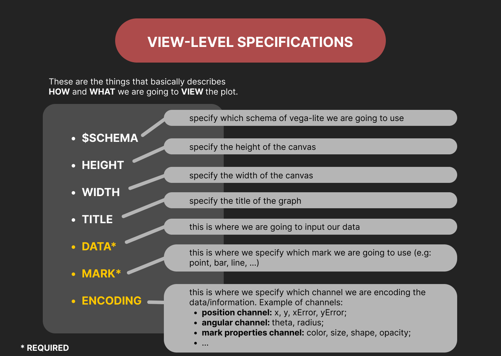
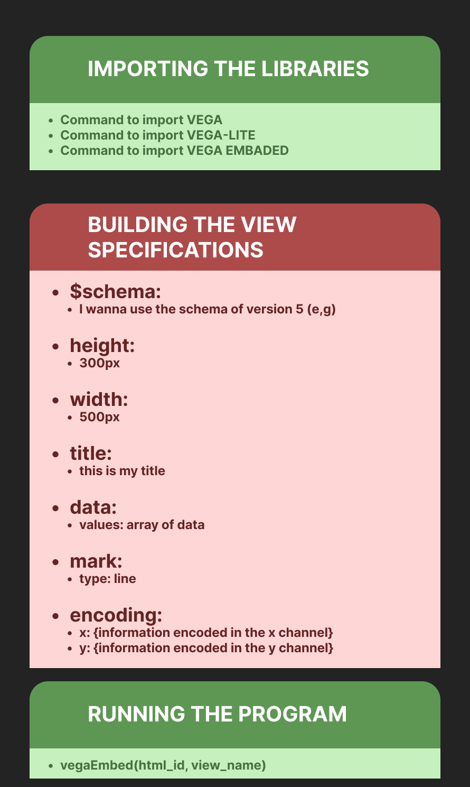

# GETTING STARTED WITH VEGA-LITE

## 🎯GOALS
---
- **LEARN** about VEGA-LITE
- **BUILD** a visual understanding on how VEGA-LITE works 
- **CREATE** your first VEGA-LITE program
- **APPLY** VEGA-LITE


## 🔍 TABLE OF CONTENT
---
1. What is VEGA-LITE?
	1. Shallow definition of VEGA-LITE
	2. Deeper definition of VEGA-LITE
	3. Key words
	4. Arrays and objects
2. Brief overview of VEGA-LITE structure
	1. Overall structure
	2. VEGA-LITE specification structure
3. Building an intuition on how to run your first program
4. More details about each of the 3 parts
	1. Importing the libraries
	2. Building the view specifications
	3. Running the program
5. Putting everything together
6. References


## 1. WHAT IS VEGA-LITE?
---
### 1.1 Shallow definition of VEGA-LITE
---
##### [1] DEFINITION

> *Vega-Lite is a **high-level** grammar of interactive graphics. It provides a concise, **declarative** JSON syntax to create an expressive range of visualizations for data analysis and presentation.*

- Key words:
    - High-level
    - Declarative
    - JSON syntax


### 1.2 Deeper definition of VEGA-LITE
---
##### [1] DEFINITION

> VEGA-LITE is an open-source, high-level visualization grammar for creating interactive visualizations of data. It provides a concise syntax for building complex visualizations using a layered approach, with support for a wide range of chart types, including bar charts, line charts, scatter plots, and more.
>
>VEGA-LITE is built on top of the VEGA visualization grammar and uses a JSON-based specification format. This allows users to easily create interactive visualizations without having to write low-level code. Instead, they can define the data, the visual encoding, and the interactive features they want using a simple and intuitive syntax.
>
>VEGA-LITE also supports interactive features such as zooming, panning, and filtering, making it easy to explore and analyze complex datasets. It is widely used in data science, research, journalism, and many other fields for creating beautiful and insightful visualizations.


### 1.3 Key words
---
- High-level:
	- *"These are programmer-friendly languages that are manageable, easy to understand, debug, and widely used in today’s times."* [2]

- Declarative
	- *"Its main focus is on 'what to solve' in contrast to an imperative style where the main focus is 'how to solve'"* [3]
	- Essa referência mostra uma tabela com as diferenças entre "Declarative" e "Imperative" 

- JSON [4], [5]
	- JSON stands for **J**ava**S**cript **O**bject **N**otation
	- JSON is a lightweight data-interchange format
	- JSON is language independent (apesar de ter JavaScript no nome, JSON é independente de qualquer liguagem de programação)

- Como EU definiria JSON
	- JSON stands for **J**ava**S**cript **O**bject **N**otation
	- JSON is a type of data structure to declare `objects` that reminds us to `arrays`
		- in `arrays` the value is stored in the positions of the array
		- in `objects` the value is stored in each `"key"`


### 1.4 Arrays and objects [5]
---
1. An _array_ is an ordered collection of values. An array begins with `[` *(left bracket)* and ends with `]` *(right bracket)*. Values are separated by `,` (*comma*).


For example:

```js
let fruits = ['apple', 'banana', 'orange'];
```

In this example, `fruits` is an array that contains three string values. We can access individual elements in the array using index notation, starting from `0` as shown bellow:

```js
console.log(fruits[0]); // Output: 'apple'
```

2. Object is an unordered collection of `key-value` pairs. An object begins with `{` (*left brace*) and ends with `}` (*right brace*). Each `key` is followed by `:` (*colon*) and the `key-value` pairs are separated by `,` (*comma*).


For example:

```js
let person = {
    "name": "John",
    "age": 30,
    "address": {
        "street": "123 Main St",
        "city": "Anytown",
        "state": "CA"
    }
};
```

In this example, `person` is an object that contains three properties: `name`, `age`, and `address`. The `address` property is itself an object that contains three properties: `street`, `city`, and `state`. We can access the values of these properties using dot ( . ) or bracket ( [ ] ) notation as shown bellow:

```js
// Using the dot notation
console.log(person.name); // Output: "John"
console.log(person.address.city); // Output: "Anytown"

// Using the bracket notation
console.log(person["name"]); // Output: "John"
console.log(person["address"]["city"]); // Output: "Anytown"
```


## 2. BRIEF OVERVIEW OF VEGA-LITE STRUCTURE
---
### 2.1 Overall structure
---
This is the basic structure of your `html` file.




### 2.2 VEGA-LITE specification structure
---
Almost every VEGA-LITE specification is going to follow this basic structure:





## 3. BUILDING AN INTUITION ON HOW TO RUN YOUR FIRST PROGRAM
---
The easiest way to start using VEGA-LITE is by following these 3 steps:

- 📚 Importing the library in your `html` file
- 🛠️ Declaring a `variable` to store the VEGA-LITE view spacifications
- ▶️ Running the program with `vegaEmbed('#html_id', variable_name)`





## 4. MORE DETAILS ABOUT EACH OF THE 3 PARTS
---
### 📚 Importing the libraries
---
You just need to insert the following lines in the `<head>` tag of your `HTML` file.

```html
<script src="https://cdn.jsdelivr.net/npm/vega@5"></script>
<script src="https://cdn.jsdelivr.net/npm/vega-lite@5"></script>
<script src="https://cdn.jsdelivr.net/npm/vega-embed@6"></script>
```


### 🛠️ Building the view specifications
---
The view specification is going to stored in a variable with an arbritary name. The code could be inside a JavaScript file or placed directly inside a `<script>` tag in the `<body>` of your `HTML` file.

```html
<script>
        let vegaLiteViewSpecifications = {
            $schema: 'https://vega.github.io/schema/vega-lite/v5.json',
            height: 300,
            width: 500,
            title: 'This is my first VEGA-LITE graph :)',
            data: {
                values: [
                    { a: 'A', b: 28 },
                    { a: 'B', b: 55 },
                    { a: 'C', b: 43 },
                    { a: 'D', b: 91 },
                    { a: 'E', b: 81 },
                    { a: 'F', b: 53 },
                    { a: 'G', b: 19 },
                    { a: 'H', b: 87 },
                    { a: 'I', b: 52 }
                ]
            },
            mark: 'bar',
            encoding: {
                x: {field: 'a', type: 'ordinal'},
                y: {field: 'b', type: 'quantitative'}
            }
        };
    </script>
```


### ▶️ Running the program
---
To run the program, you just need to call the following method at the end of your `<script>` tag.

```html
<script>
    .
    .
    .
    vegaEmbed('#tag-id', vegaLiteViewSpecifications);
</script>
```

The `vegaEmbed(ARGUMENT_1 , ARGUMENT_2)` receivies two arguments when being called

- **ARGUMENT_1:** this is the `id` of the `html` tag you want to show your graph
- **ARGUMENT_2:** this is the name of the variable you used to store the vega-lite view specifications 


## 5. PUTTING EVERYTHING TOGETHER
---
The hole code to run your first VEGA-LITE program would look like this

```html
<!DOCTYPE html>
<html lang="en">

<head>
    <meta charset="UTF-8">
    <meta http-equiv="X-UA-Compatible" content="IE=edge">
    <meta name="viewport" content="width=device-width, initial-scale=1.0">
    <title>1 - Introduction</title>

    <!-- IMPORTING THE LIBRARIES VIA CDN -->
    <script src="https://cdn.jsdelivr.net/npm/vega@5"></script>
    <script src="https://cdn.jsdelivr.net/npm/vega-lite@5"></script>
    <script src="https://cdn.jsdelivr.net/npm/vega-embed@6"></script>
    <!-- ------------------------------- -->

</head>

<body>

    <div id="i-wanna-place-the-plot-here"></div>
    
    <script>
        /* -------------- BUILDING THE VEGA-LITE VIEW SPECS -------------- */
        let vegaLiteViewSpecifications = {
            $schema: 'https://vega.github.io/schema/vega-lite/v5.json',
            height: 300,
            width: 500,
            title: 'This is my first VEGA-LITE graph :)',
            data: {
                values: [
                    { a: 'A', b: 28 },
                    { a: 'B', b: 55 },
                    { a: 'C', b: 43 },
                    { a: 'D', b: 91 },
                    { a: 'E', b: 81 },
                    { a: 'F', b: 53 },
                    { a: 'G', b: 19 },
                    { a: 'H', b: 87 },
                    { a: 'I', b: 52 }
                ]
            },
            mark: 'bar',
            encoding: {
                x: {field: 'a', type: 'ordinal'},
                y: {field: 'b', type: 'quantitative'}
            }
        };
        /* --------------------------------------------------------------- */


        /* -------------- RUNNING THE VEGA-LITE VIEW SPECS -------------- */
        vegaEmbed('#i-wanna-place-the-plot-here', vegaLiteViewSpecifications);
        /* --------------------------------------------------------------- */
    </script>
    
</body>

</html>
```


## 📝 REFERENCES
---
**used in this tutorial**

[1] (Usado na definição de vega-lite) https://vega.github.io/vega-lite/

[2] (Usado em "Key words": High-level) https://byjus.com/gate/difference-between-high-level-and-low-level-languages/#:~:text=High%2Dlevel%20languages%20require%20the,instructions%20of%20the%20machine%20language.&text=These%20languages%20have%20a%20very%20low%20memory%20efficiency.

[3] (Usado em "Key words": Declarative) https://www.geeksforgeeks.org/functional-programming-paradigm/

[4] (Usado em "Key words": JSON) https://www.w3schools.com/js/js_json_intro.asp

[5] (Usado em "Key words": JSON e na seção 1.4) https://www.json.org/json-en.html


**extra references:**

[6] (Entrevista com o criador) https://www.youtube.com/watch?v=bCTtibplEg8&ab_channel=Weights%26Biases

[7] (Aquele primeiro tutorial que encontrei) https://www.youtube.com/watch?v=zJPa8tNKGR4&ab_channel=ResearchBazaarArizona

[8] (github do VEGA-LITE) https://github.com/vega/vega

[9] (Exemplo de gráficos VEGA-LITE no Observable - site alternativo para fazer os plots - acho que aqui eles usam aquele VEGA-LITE API que é mais difícil) https://observablehq.com/@cmudig/a2-example-movies-data
